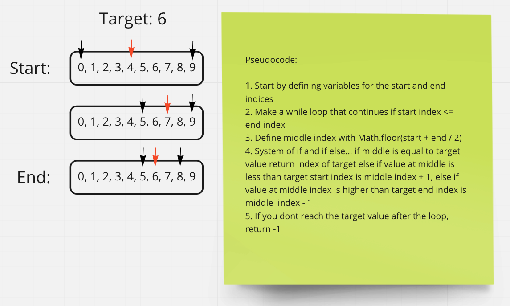

# Insert to Middle of an Array

In this code challenge you are tasked with writing a function that takes in a sorted array and a search key. You must return the index of the array element that is equal to the value, or -1 if the element is not in the array. You may not use any built in array methods to complete this task.

## Whiteboard Process

Below is an image of the basic idea of the algorithm employed to complete this taste. This image was made with Miro.

## Approach & Efficiency

The approach to this algorithm is to start by defining the starting and ending indices of the array. You must use a while loop instead of a for loop and define the center index at the beginning. This is done by adding the starting and ending indices and dividing by 2. Then you make a system of checks checking to to see if the target value is equal to, lower than, or higher than the target value. If it is equal you are done, else if it is lower the start index is equal to the middle value + 1 and if it is higher the end index is = middle index - 1. Repeat until you have found the value or seen that it is not there.
