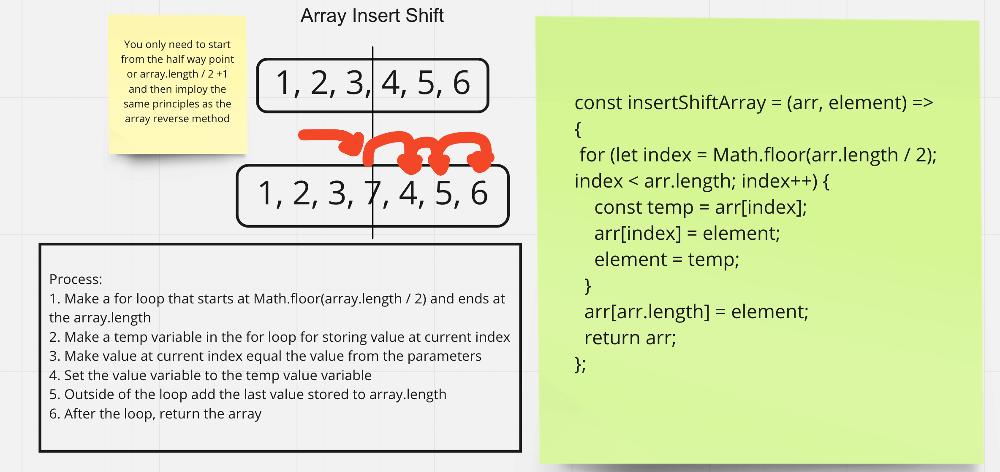

# Insert to Middle of an Array

In this code challenge you are tasked with writing a function that takes in an array and a value to be added and adds that value to the middle of the array. You may not use any built in array methods to complete this task.

## Whiteboard Process

Below is an image of the basic idea of the algorithm employed to complete this taste. This image was made with Miro.

## Approach & Efficiency

My approach was to use modify the same array that was given through parameters starting from the center. It works with both odd and even array lengths. You start from the center and rotate the elements down the line reusing the parameter declared variable.
