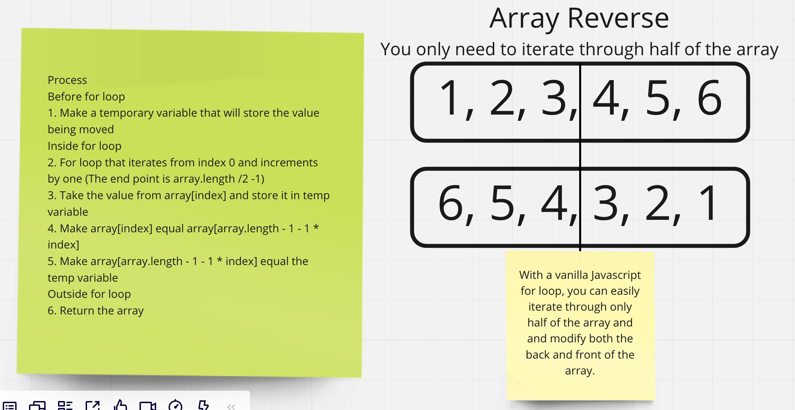

# Reverse and Array

In this code challenge you are tasked with writing a function that reverses the contents of an array. You may not use any built in array methods to complete this task.

## Whiteboard Process

Below is an image of the basic idea of the algorithm employed to complete this taste. This image was made with Miro.

## Approach & Efficiency

The approach that was taken for this algorithm was of only working with half the array. I decided that taking only half the array would be the fastest way to reverse the array without having to iterate through the whole array and returning a new one.
