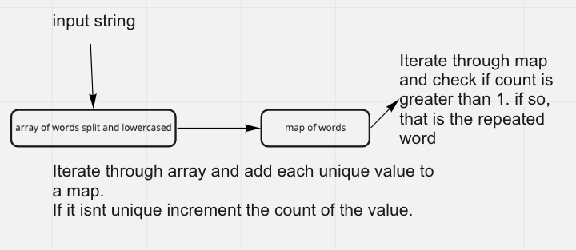

# Hashmap Repeated Word

## Problem Domain

We are tasked with making a function that can take in a string and return multiple analyses of that string. We should return a string at the end.

## UML

