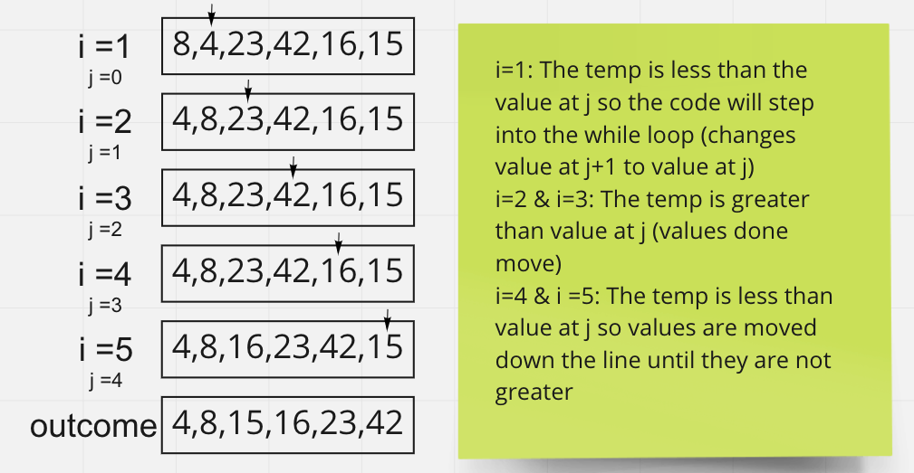

# Blog Post

Today I am reviewing the insertion sorting algorithm. We are given a sample pseudocode and are asked to step through it using sample data.

The sample data consists of an array of numbers: [8, 4, 23, 42, 16, 15].

The pseudocode is:

```pseudocode

InsertionSort(int[] arr)

    FOR i = 1 to arr.length

      int j <-- i - 1
      int temp <-- arr[i]

      WHILE j >= 0 AND temp < arr[j]
        arr[j + 1] <-- arr[j]
        j <-- j - 1

      arr[j + 1] <-- temp

```

This function should take the array that is passed as a parameter and sort the contents in ascending order.

[8,4,23,42,16,15] should become [4,8,15,16,23,42].

Step through:

1. [4,8,23,42,16,15]
2. [4,8,23,42,16,15]
3. [4,8,23,42,16,15]
4. [4,8,16,23,42,15]
5. [4,8,15,16,23,42]

The array will only take 5 steps to complete the sorting process.

## Visual


