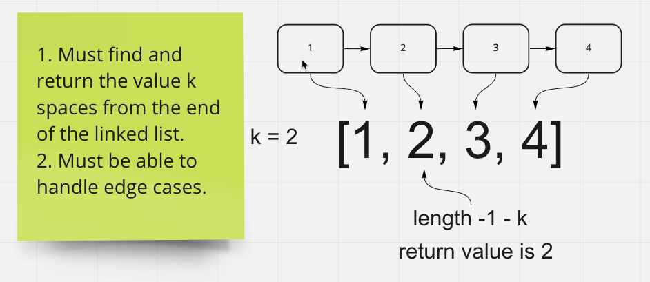

# Linked List kth

In this code challenge we are tasked with making a method for a linked list. This method should be used to find a node k places from the end of the linked list. You may not use built in methods but you can use methods made previously in your linked list.

## Whiteboard Process

## Approach & Efficiency

I began by making variables to hold the current node so i can interate through the list and save the nodes in an array variable and more easily get the value once you have iterated.
