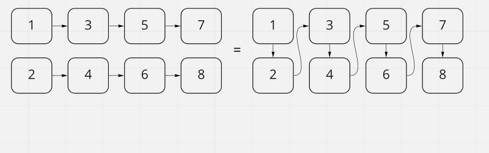

# Linked List Zip

In this code challenge we are tasked with making a method for a linked list. This method should take in two linked lists and merge them together. It should take the first linked list's head as the head and alternate each node from both lists into one. You may not use built in methods but you can use methods made previously in your linked list.

## Whiteboard Process

## Approach & Efficiency
