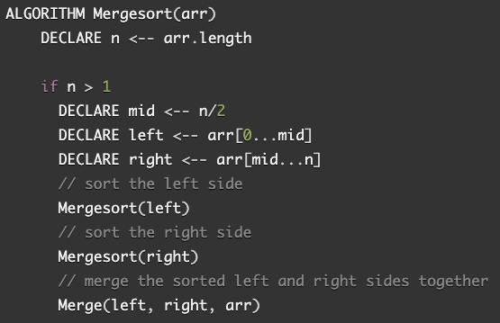
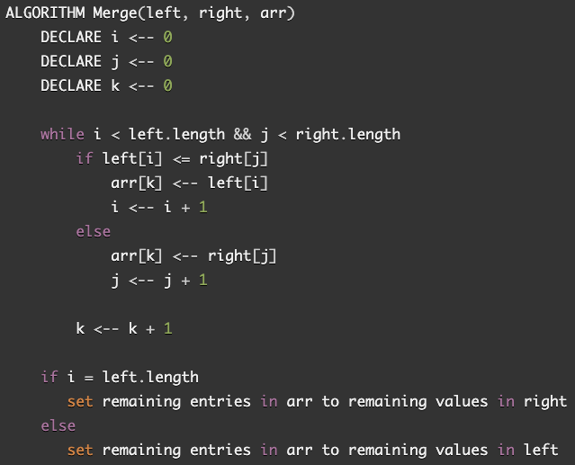
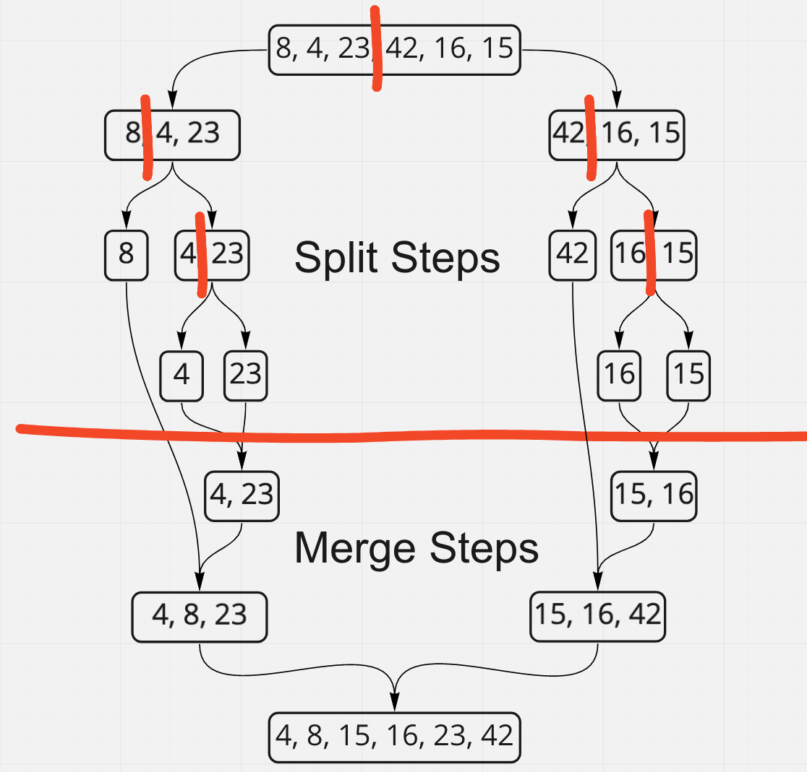

# Merge Sort Blog

In the merge sort array algorithm, we take in an unsorted array and constantly split it in half until each sub array contains only one element. Then, we merge them back in order.

## Algorithm

Split the input array in half. Continue to split the resulting arrays in half until the elements are in their own subarrays. Merge the subarrays in ascending order. Repeat until the subarrays have all been merged.

## Pseudocode

### Merge Sort

### Merge

## Steps

What happens is that the left side gets split and merged before the right and then the two sides get added to each other.

