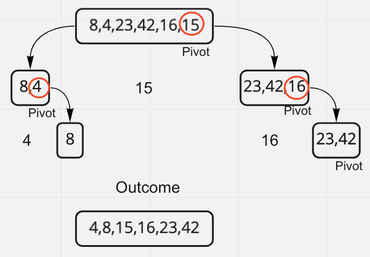

# Blog Post

Today I am reviewing the quick sort algorithm. The algorithm that was given to use by the instructor was not perfect and needed some adjustments but it is as follows.

[8,4,23,42,16,15] should become [4,8,15,16,23,42].

Step through:

What happens as the code progresses through its steps is that the values to the left of the last array value are checked with a pivot value. If they are bigger than the pivot value, they are swapped with the pivot value. This is continued until there are no more values to be checked.
