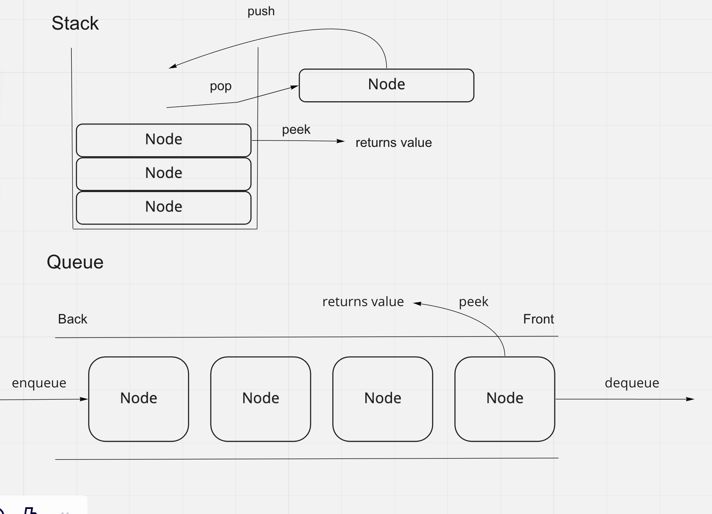

# Stacks and Queues

In this code challenge you are tasked with making a stack and a queue class. The stacks must be able to push, pop, peek, check if the stack is empty. The queues must be able to enqueue, dequeue, peek, and check if the stack is empty.

## Whiteboard Process

## Approach & Efficiency

I took the same methods from the linked list and adapted them for stacks and queues.

Stacks:

I thought of this almost like a regular linked list. I used the insert method from my linked list class to add things to the top of the stack and a reverse to remove some stuff from the top.

Queues:

I used almost the same methods as linked lists and added a back constructor when making the queue class so that i didnt have to iterate through the queue to add to the back of the queue.
