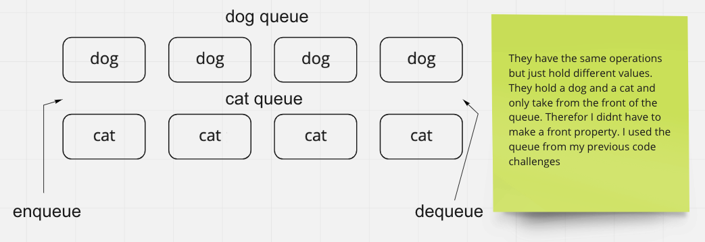

# Stack Queue Animal Shelter

In this code challenge we are tasked with making an animal shelter that uses queues to return animals.

## Whiteboard Process

## Approach & Efficiency

My process was to use the Queue class i had made in previous code challenges and implement its methods to dequeue and enqueue in the animal shelter class.
