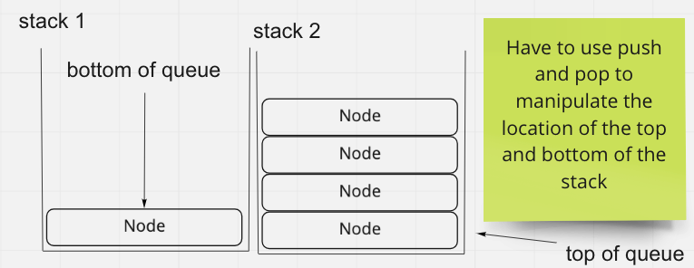

# Stack Queue Pseudo

In this code challenge you are tasked with making a stack and a queue class. The stacks must be able to push, pop, peek, check if the stack is empty. The queues must be able to enqueue, dequeue, peek, and check if the stack is empty.

## Whiteboard Process

## Approach & Efficiency

This was super simple, all you had to do is move all of the bits from one stack to another to add something to the bottom of the stack (end of the queue) and then when remove, pop from the first stack.
