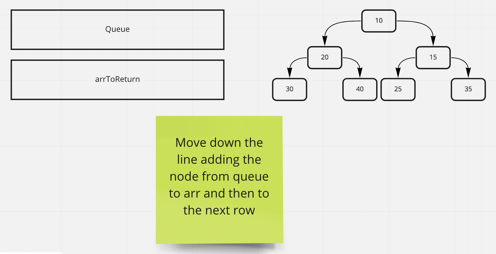

# Tree-Breadth-First

In this code challenge we are tasked with iterating through a tree using the breadth first data structure.

## Whiteboard Process

## Approach & Efficiency

The approach for this challenge is to make two arrays that you use as queues and add the row's nodes to it when you are on that row. Make sure the you are checking if the node is null and add the value to the arrToReturn when you are on that node in the queue.
