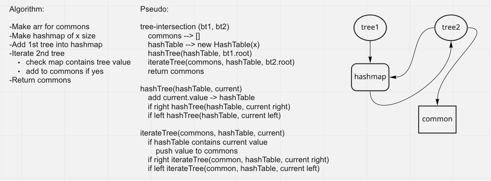

# Tree Intersection

## Problem Domain

In this code challenge we are tasked with making a function that accepts two trees and returns a set of values (array or hashmap) with the common values.

## Approach & Efficiency

### Algorithm

- Make arr for commons
- Make hashmap of x size
- Add 1st tree into hashmap
- Iterate 2nd tree
  - Check map contains tree value
  - Add to commons if yes
- Return commons

## Whiteboard Process

