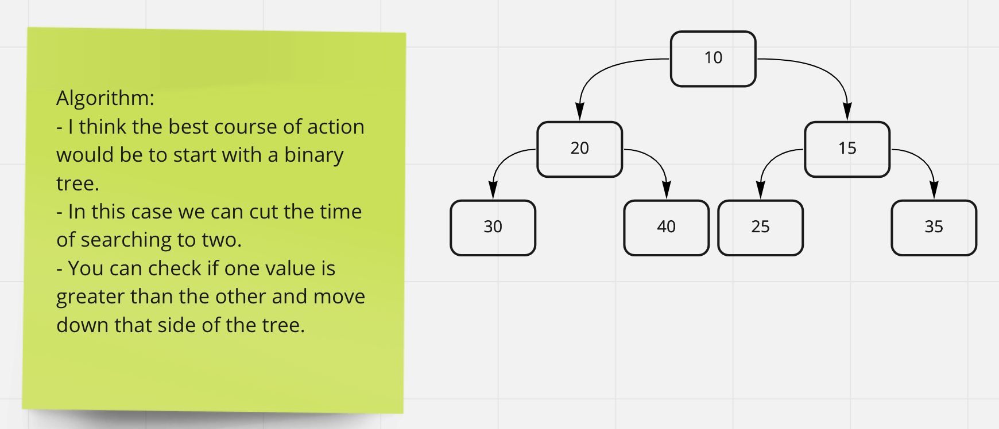

# Tree-max

In this code challenge you are tasked with finding the highest value in the tree by looking through each node.

## Whiteboard Process

## Approach & Efficiency

My approach with this challenge was not like I wrote in the UML. I decided to go through and see which side had the higher value by searching through the whole tree at once.
