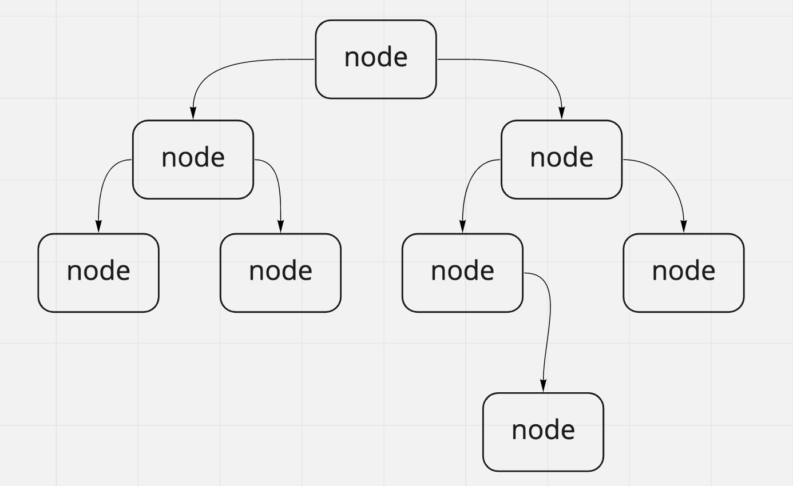

# Trees

In this code challenge you are tasked with making a couple methods for the trees class.

## Whiteboard Process

## Approach & Efficiency

The approach I took for this assignment was pretty straight forward. I took the functions we made in class and adapted it to my own class.
